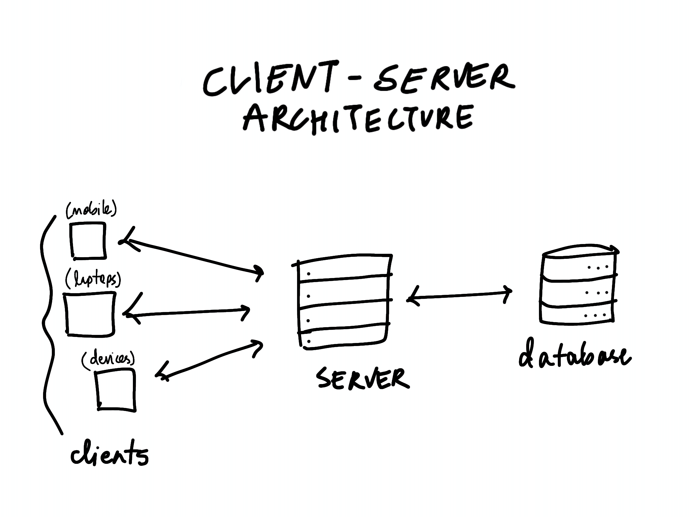

# Client-Server Architecture

A client is the device that a user is using to access a website through a web browser. It is the front end for a user and displays information visually on the device. It makes requests when some data is required to the database where the data is stored as it cannot store large amounts of data. But the client cannot directly connect with the database as it brings up security concerns. Hence a "server" is used. The server is a computer/program that reads the requests from the client and responds to it. It is responsible for all the logic and data handling. The server connects to the database and fetches the required information.

When we search for a website on a browser say google.com, it does not understand the human language and hence needs an IP address. It communicates with something called a DNS server which converts the website domain name into an IP address. The browser the connects to the website's server by sending a connection request. 

The server receives the request, processes it and sends back a response containing the html webpage. The browser reads the HTML and displays it. Since a webpage does not contain only HTML and need CSS, JavaScript and images so the browser sends more requests to fetch all these. The complete page is then displayed to the user and more requests are made when the user needs more data.

Hence the client server consists of 3 components. The client devices, the server computer and the database.
